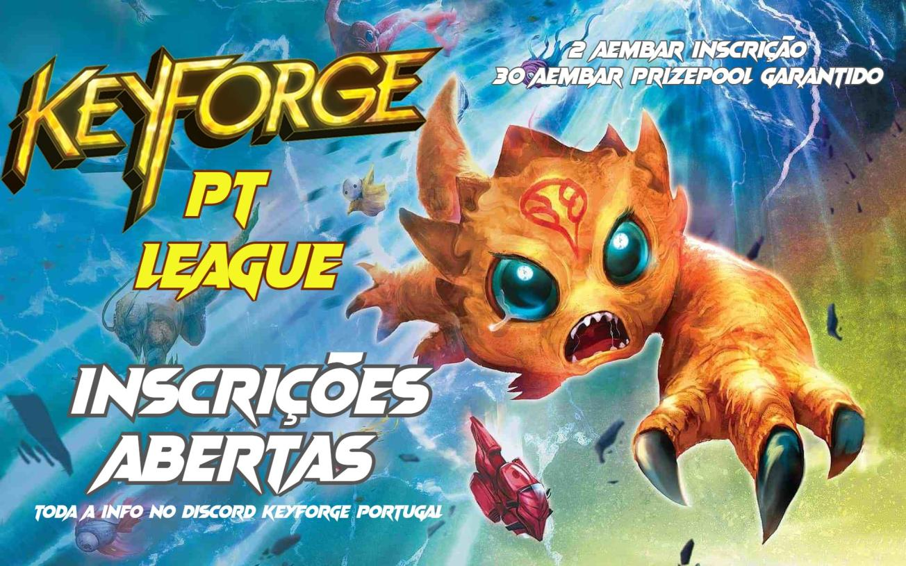

## Keyforge PT League

### Formato

4 grupos round robin que apuram 2 jogadores para a fase a eliminar (top 8). Dependendo do nº de inscritos podem ser aumentados para top16. 

Devem ser jogadas 2 rondas por semana. 

Prizepool: 30 aember garantido. Poderá ser maior consoante nº de inscritos e possíveis patrocínios. 

Distribuição do prizepool será anunciada após o processo de inscrição. 

* **Inscrição:** 2 aembar.
* *Inscrições terminam a 15 de Janeiro*
* Fase de grupos - MAX 70 SAS
* TOP8 - MAX 65 SAS

### Regras

*HOTF banido*

1. Torneio jogado no TCO
2. Brackets realizadas no challonge.
3. Jogos de 40 min. 
4. Jogadores devem submeter o deck (fazer upload no DoK da foto do archon card e enhancements) que vão utilizar na liga antes do inicio da mesma.
5. O SAS contabilizado será aquele que constar no DoK no momento de inscrição da liga.
6. São permitidos espectadores.
7. Durante a liga devem anunciar no discord sempre que se realizar um jogo. Exemplo: “kidmanxdx vs kidmanuxdx hoje às 23/ a começar agora” 
8. O manual mode pode ser utilizado desde que justificado antes do seu pedido e aceite pelo oponente.
9. Na eventualidade de haver alguma situação de haver disputa por alguma situação durante o jogo, por erro de implementação do TCO, os dois jogadores podem chegar a acordo para resolver o problema com o manual mode. Caso não cheguem a um consenso, a implementação do TCO é que prevalece
10. Regras sujeitas a qualquer atualização considerada relevante e necessária. 

### 👉 [Inscrições](https://docs.google.com/forms/d/e/1FAIpQLSeDMXKuvAMteUqxG-giIBG2r8ZqDjYDYmkXd--jgj4X2PgoeQ/viewform?usp=send_form)